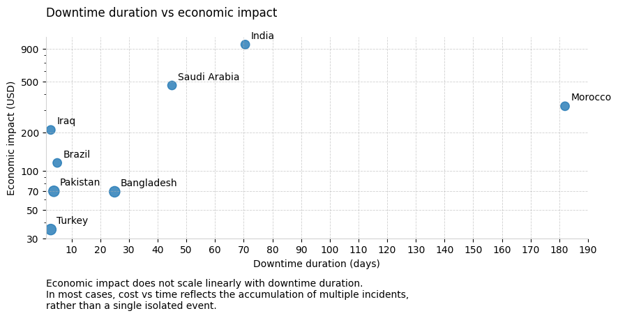

# Visualizing Economic Impact with Matplotlib

This repository demonstrates how to build a clean, executive-friendly scatter plot using Matplotlib, focused on economic impact vs time, handling:
- Logarithmic scales without harming readability
- Custom tick formatting (K / M)
- Grid control (horizontal and vertical)
- Axis limits based on real data
- Editorial-style annotations

## Why this matters
Poorly configured charts distort analysis.
This example shows how small configuration choices
can dramatically improve clarity and trust.

## Example output

## How to run
pip install -r requirements.txt
python src/scatter_plot.py
